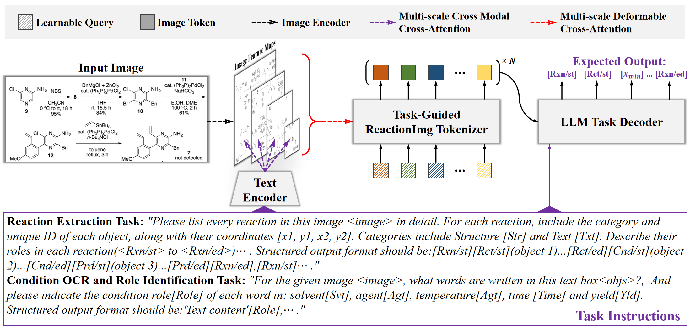

# ReactionImgMLLM
This is the offical code of following paper "ReactionImgMLLM: A Multimodal Large Language Model for Image-Based Reaction Data Extraction".

## Highlights
<p align="justify">
In this paper, we present ReactionImgMLLM, a multimodal large language model for different reaction image data extraction tasks such as reaction extraction task, condition OCR and role identification task. We first formulate these tasks into different task instructions. The model then aligns the task instructions with features extracted from reaction images. An LLM-based decoder can further make predictions based on these instructions. For the reaction extraction task, our model can achieve over 84%-92% soft match F1 score on multiple test sets, which significantly outperforms the previous works. 
The experiments also show the outstanding condition OCR and role identification abilities.
  
[comment]: <> ()

<div align="center">
Overall Architecture of our ReactionImgMLLM.
</div> 

## Using the code
Please clone the following repositories:
```
git clone https://github.com/CYF2000127/ReactionImgMLLM
```

## Experiments

### Requirement
```
pip install -r requirements.txt
```

### Data preparation
For training and inference, please download the following datasets to your own path.
#### Datasets
1. **Synthetic:**  [Pistachio](https://www.dropbox.com/s/mxvm5i8139y5cvk/pubchem.zip?dl=0)
2. **Realistic:**  [ACS](https://www.dropbox.com/s/3podz99nuwagudy/uspto_mol.zip?dl=0)

#### Data generation
Or use the code in [`data_generation`](./data_generation) to generate any number of synthetic reaction images.
Note that you should download the original Pistachio dataset first.


### Training
1. Change the name of datasets in [`DEFAULT_TRAIN_DATASET.py`](./config/_base_/dataset/DEFAULT_TRAIN_DATASET.py) for different training stages.
2. Run the following command:
```
sh train.sh
```
 

### Inference
Run the following command:
```
sh eval.sh
```

### Demo
Run the following command to launch a Gradio web demo:
```
python mllm/demo/webdemo_re.py --model_path /path/to/shikra/ckpt
```

More model checkpoints is coming soon! 


### Acknowledgement
Our code is based on [Shikra](https://github.com/shikras/shikra) and [VisionLLM](https://github.com/OpenGVLab/VisionLLM), thanks their great jobs!
